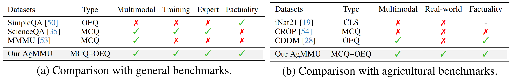

<h1>
  
  <span class="mmmu" style="vertical-align: middle">AgMMU: A Comprehensive Agricultural Multimodal Understanding and Reasoning Benchmark</span>
</h1>

<div class="is-size-5 publication-authors">
  <span class="author-block">
    <a href="https://github.com/AgMMU/AgMMU" style="text-decoration:color: inherit;" target="_blank">Aruna Gauba<sup>1,2,5</sup>*</a>,
  </span>
  <span class="author-block">
    <a href="https://github.com/AgMMU/AgMMU" style="text-decoration:color: inherit;" target="_blank">Irene Pi<sup>1,3,5</sup>*</a>,
  </span>
  <span class="author-block">
    <a href="https://yunzeman.github.io/" style="text-decoration:color: inherit;" target="_blank">Yunze Man<sup>1,4,5</sup>†</a>,
  </span>
  <span class="author-block">
    <a href="https://ziqipang.github.io/" style="text-decoration:color: inherit;" target="_blank">Ziqi Pang<sup>1,4,5</sup>†</a>,
  </span>
  <span class="author-block">
    <a href="https://vikram.cs.illinois.edu/" style="text-decornone; color: inherit;">Vikram S. Adve<sup>1,4,5</sup></a>,
  </span>
  <span class="author-block">
    <a href="https://yxw.cs.illinois.edu/" style="text-decornone; color: inherit;">Yu-Xiong Wang<sup>1,4,5</sup></a>
  </span>
</div>


<sup>1</sup>University of Illinois at Urbana-Champaign, <sup>2</sup>Rice University, <sup>3</sup>Carnegie Mellon University
<br><sup>4</sup>AIFARMS, <sup>5</sup>Center for Digital Agriculture at UIUC


$^*$ Equal contribution, $^{†}$ Project Lead

[[`Project Page`](https://agmmu.github.io/)][[`Paper`](https://arxiv.org/abs/2504.10568)][[`Huggingface Dataset`](https://huggingface.co/datasets/AgMMU/AgMMU_v1)][[`AIFARM Demo from UIUC`](https://uiuc.chat/cropwizard-1.5)]


## 1. Introduction to AgMMU

AgMMU is a challenging real‑world benchmark for evaluating and advancing vision-language models (VLMs) in the knowledge‑intensive domain of agriculture. Unlike prior datasets that rely on crowdsourced prompts, AgMMU is distilled from **116231 authentic dialogues** between everyday growers and *USDA-authorized Cooperative Extension experts*. 
Through a three‑stage pipeline: automated knowledge extraction, QA generation, and human verification, we construct (i) **AgMMU**, an *evaluation set* of 746 multiple‑choice questions (MCQs) and 746 open‑ended questions (OEQs), and (ii) **AgBase**, a *development corpus* of 57,387 multimodal facts covering five high-stakes agricultural topics: insect identification, species identification, disease categorization, symptom description, and management instruction.

DIMITRY'S NOTES: The main changes to the code that can be found are in score.py, utils.py and eval.py. There are a couple of things you need to do to run the code, you need to download the necessary json files and images, while also changing the pathings in each file, I would just command shift f to find all instance of "dermakov". Use the Hugging Face website to download these. There are 3 versions of utils.py and eval.py, the use the rag and no rag versions by copy and pasting them into utils.py and eval.py. To utilize rag, you have to use UniIR (https://github.com/DimaErmakov/UniIR/) to get the Necessary embeddings to find the top retrieval candidates. You can then use Visualize retrieval to format the retrieved candidates. Fine tuning is also possible by using the no rag version of utils. One final thing to note is what each json file is:

**6k_evalset_wbg.json** = set to use for benchmarking
**data/6k_evalset_wbg_add_on.jsonl** = cleaned version for embedding queries  
**agmmu_ft_hf1.json** = full fine tuning set (Ag base)
**cand_rag3.jsonl** = candidate pool**
mbeir_sample_single_pool_test_k10_run.txt** = the end result of embedding to then use visualize_retrivial on
**mbeir_sample_test.jsonl** = the queries (should be a modified version of 6k_evalset_wbg.json by using clean_and_convert_json.py to clean 6k_evalset_wbg.json and then use add_fields_to_json.py) to embed for RAG


AgMMU is created to develop factually accurate VLMs following the principle of [SimpleQA](https://openai.com/index/introducing-simpleqa/). For the research community, AgMMU uniquely features both close and open-ended questions, and a large-scale agricultural knowledge base for fine-tuning.



## 2. Data Preparation

Our dataset is hosted on Hugging Face. You can download the dataset from [here](https://huggingface.co/datasets/AgMMU/AgMMU_v1). It contains the following parts:

- Evaluation set: Download the `agmmu_hf1.json` for evaluating models on OEQs and MCQs.
- (Optional) Knowledge base: Download our knowledge base for fine-tuning models.
- Images: Download the `images_part_x.tar.gz`, then extracting them to `images/`.

## 3. Inference and Evaluation

Adter downloading the dataset, you can evaluate your model on the AgMMU dataset by following the instructions below.

### 3.1 Overview
The `scoring_eval_pipeline/evaluation/eval.py` script evaluates and scores model outputs on the AgMMU dataset. It supports multiple-choice (MCQ) and open-ended question (OEQ) formats and expects outputs to follow a specific JSON structure.

### 3.2 Inference

To run inference of an VLM, an example command is as follows:

```bash
   python evaluate.py \
     --data_path /path/to/data.json \
     --output_path /path/to/output.json \
     --image_dir /path/to/image_directory/
```

- `--data_path`: Path to the JSON file.
- `--output_path`: Path to save the evaluation results.
- `--image_dir`: Directory containing input images named as `<faq-id>-1.jpg`.

If you want to run customized VLMs, follow the instructions below:
- Update the `run_llms()` function in `evaluate.py` to call your own model.
- Edit the `llm_map` passed into `eval_data()` in `main()`: `llm_map={"your-model-name-oeq": {}, "your-model-name-mcq": {}}`
- Note that model names must end with `-oeq` for open-ended or `-mcq` for multiple choice.

### 3.3 Format for Evaluation

To use our evaluation script, please format your output by the following format:

- `agmmu_question`: The original question object.
- `qtype`: Type of the question (e.g., `insect/pest`).
- `llm_answers`: A dictionary mapping LLM names to their answers.

We provide an example format below:

```json
[
  {
    "agmmu_question": {
      "question": "What insect is indicated by the image?",
      "options": [
        "roseslug sawflies",
        "japanese beetle",
        "spotted lanternfly nymph",
        "gypsy moth larva"
      ],
      "answer": "roseslug sawflies",
      "question_background": "The following question has this background information:\nbackground info: plant is in a balcony container, has been sprayed with Neem oil with no effect, plant is Eden White Climber\nspecies: rose\nlocation: Montgomery County,Maryland\ntime: 2023-07-19 02:00:44\n",
      "letter": "A."
    },
    "qtype": "insect/pest",
    "llm_answers": {
      "gpt-4o-oeq": {
        "answer": "Aphids"
      },
      "gpt-4o-mcq": {
        "answer": "C"
      }
    }
  }
]
```

Most importantly, the `answer` key inside each model entry should contain the model's response.

### 3.4 Evaluation and Metric Calculation

The `scoring_eval_pipeline/scoring/score.py` script evaluates and scores model outputs on the AgMMU dataset.

To run the scoring script, use the following command:

```bash
python score.py \
  --input_file input_file.json \
  --output_file output_file.json
```

The `--output_file` will contain:
- Per-question scores
- A printed summary with harmonic means for overall evaluation metrics

### 3.5 Installation

We only use the most common libraries in python and deep learning. If you have any issues, please remember to install the dependencies of:
```bash
pip install transformers==4.37.2 torch==2.1.2 openai==1.35.13 tqdm==4.66.4 Pillow==10.3.0 requests==2.32.3 python-dotenv==1.0.1 beautifulsoup4==4.12.3
```
## 4. Citations

If you find our dataset useful, please cite our paper:

```
@article{gauba2025agmmu,
  title={AgMMU: A Comprehensive Agricultural Multimodal Understanding and Reasoning Benchmark},
  author={Gauba, Aruna and Pi, Irene and Man, Yunze and Pang, Ziqi and Adve, Vikram S and Wang, Yu-Xiong},
  journal={arXiv preprint arXiv:2504.10568},
  year={2025}
}
```

## 5. Acknowledgements

We appreciate the help from [AskExtension](https://ask2.extension.org/) for providing the raw images and user-expert conversations for building AgMMU.
